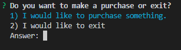
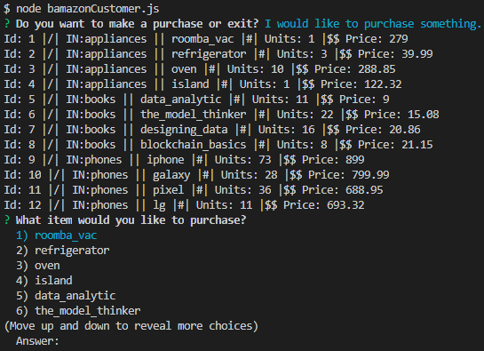
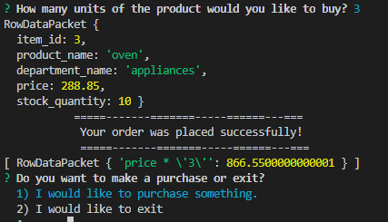
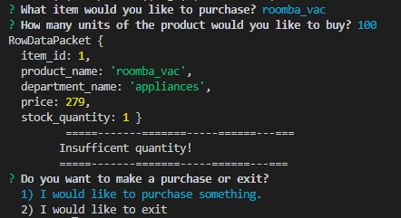
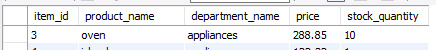
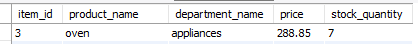
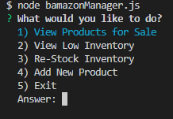
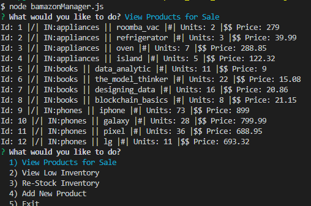
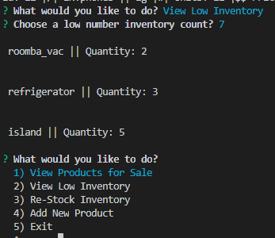
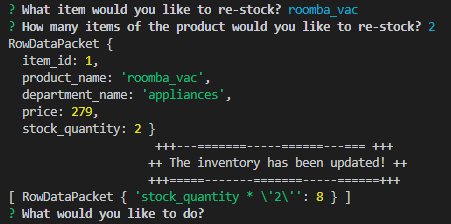

# bAmazon

## This is my bamazon store using MySQL & Node.js

### The store is seen through the perspective of a **Consumer** & **Manager**

### _**CUSTOMER OVERVIEW**_

1. It will show the available items for sale
1. Allows the user to make a purchase of multiple units of an item
1. Will prompt the total price of the units of the item
1. The database will then update with the total units being deduced by the number of units selected by the user

---

1. **OPTIONS**

    
1. **SHOW ITEMS FOR SALE**

    
1. **USER WILL CHOOSE HOW MANY UNITS TO BUY**
    1. **IF THERE IS ENOUGH IN STOCK WILL SHOW PRICE TOTAL**

    

    2. **IF THERE IS NOT ENOUGH IN STOCK WILL SHOW _INSUFFICENT QUANTITY_**

    

1. **DATABASE TABLE PRIOR TO PURCHASE**

    

1. **DATABASE TABLE UPDATED AFTER PURCHASE**

    

---

### _**MANAGER OVERVIEW**_

1. It will show available products
1. To search for _low_ inventory the user can input a number and it will show inventory for products that have an amount less than the amount entered.
1. The manager is allowed to _add-more_ of any item currently in store.

--- 

_**Application walk through:**_

1. **INITIAL OPTIONS**

    

1. **VIEW ITEMS**

    

1. **VIEW LOW INVENTORY**

    

1. **RE-STOCK ITEMS**

    

1. **DATABASE :: RE-STOCK :: UPDATE**

    